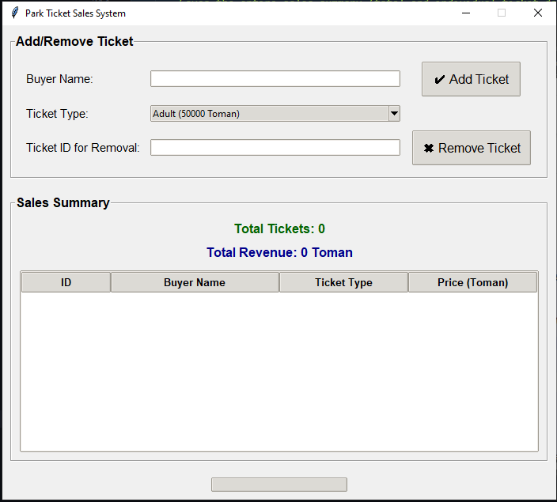

#About this Project 

import tkinter as tk
from tkinter import messagebox, ttk # ttk is used for modern-looking widgets like Treeview

# --- Main application class ---
class TicketSalesApp:
    def __init__(self, master):
        """
        Initializes the main application window and its components.
        """
        self.master = master
        master.title("Park Ticket Sales System") # Sets the window title
        master.geometry("700x600") # Sets initial window size (width x height)
        master.resizable(False, False) # Prevents user from resizing the window

        # --- Core variables for the application ---
        self.TICKET_TYPES = {
            "Adult": 50000,   # Adult ticket
            "Child": 30000,   # Child ticket
            "Senior": 25000,  # Senior ticket
            "Family": 120000  # Family ticket (e.g., includes multiple people)
        }
        self.sold_tickets = [] # List to store all sold ticket information
        self.next_ticket_id = 1 # Counter for assigning unique IDs to new tickets

        # --- Setup UI styles and widgets ---
        self._setup_styles()    # Configures the modern Tkinter (ttk) widget styles
        self._create_widgets()  # Creates and places all UI elements (buttons, labels, entry fields)
        self.update_summary()   # Initializes the summary display with current (empty) data

    def _setup_styles(self):
        """
        Configures the visual styles for ttk widgets to make them look modern and appealing.
        """
        s = ttk.Style()
        s.theme_use('clam') # Choose a modern theme ('clam', 'alt', 'default' are common)
        s.configure('TButton', font=('Arial', 12), padding=10) # Styles for all ttk.Buttons
        s.configure('TLabel', font=('Arial', 11))             # Styles for all ttk.Labels
        s.configure('TEntry', font=('Arial', 11))             # Styles for all ttk.Entry widgets
        s.configure('Treeview.Heading', font=('Arial', 10, 'bold')) # Styles for Treeview headers
        s.configure('Treeview', font=('Arial', 10))                 # Styles for Treeview content

    def _create_widgets(self):
        """
        Creates and arranges all the user interface elements (widgets) on the window.
        """
        # --- Input Frame: For adding and removing tickets ---
        input_frame = tk.LabelFrame(self.master, text="Add/Remove Ticket", padx=10, pady=10, font=('Arial', 12, 'bold'))
        input_frame.pack(pady=10, padx=10, fill="x") # Places the frame at the top, expands horizontally

        # Buyer Name Input
        tk.Label(input_frame, text="Buyer Name:", font=('Arial', 11)).grid(row=0, column=0, padx=5, pady=5, sticky="w")
        self.buyer_name_entry = ttk.Entry(input_frame, width=30)
        self.buyer_name_entry.grid(row=0, column=1, padx=5, pady=5, sticky="ew")

        # Add Ticket Button
        self.add_button = ttk.Button(input_frame, text="✔ Add Ticket", command=self.add_ticket)
        self.add_button.grid(row=0, column=2, padx=10, pady=5)
        
        # Ticket Type Dropdown
        tk.Label(input_frame, text="Ticket Type:", font=('Arial', 11)).grid(row=1, column=0, padx=5, pady=5, sticky="w")
        
        # Create list of ticket options with price included for the combobox
        ticket_options_with_price = [f"{name} ({price} Toman)" for name, price in self.TICKET_TYPES.items()]
        self.ticket_type_combobox = ttk.Combobox(input_frame, values=ticket_options_with_price, state="readonly", width=28)
        self.ticket_type_combobox.grid(row=1, column=1, padx=5, pady=5, sticky="ew")
        self.ticket_type_combobox.set(ticket_options_with_price[0]) # Sets the first item as default selection

        # Ticket ID for Removal Input
        tk.Label(input_frame, text="Ticket ID for Removal:", font=('Arial', 11)).grid(row=2, column=0, padx=5, pady=5, sticky="w")
        self.remove_id_entry = ttk.Entry(input_frame, width=30)
        self.remove_id_entry.grid(row=2, column=1, padx=5, pady=5, sticky="ew")

        # Remove Ticket Button
        self.remove_button = ttk.Button(input_frame, text="✖ Remove Ticket", command=self.remove_ticket)
        self.remove_button.grid(row=2, column=2, padx=10, pady=5)

        input_frame.grid_columnconfigure(1, weight=1) # Makes the middle column (input fields) expand with the window

        # --- Summary Frame: Displays total sales and sold ticket list ---
        summary_frame = tk.LabelFrame(self.master, text="Sales Summary", padx=10, pady=10, font=('Arial', 12, 'bold'))
        summary_frame.pack(pady=10, padx=10, fill="both", expand=True) # Fills remaining space and expands

        # Total Tickets Label
        self.total_tickets_label = tk.Label(summary_frame, text="Total Tickets: 0", font=('Arial', 12, 'bold'), fg="darkgreen")
        self.total_tickets_label.pack(pady=(0, 5)) # Adds vertical padding

        # Total Revenue Label
        self.total_revenue_label = tk.Label(summary_frame, text="Total Revenue: 0 Toman", font=('Arial', 12, 'bold'), fg="darkblue")
        self.total_revenue_label.pack(pady=(0, 10))

        # Treeview (Table) for sold tickets details
        self.tree = ttk.Treeview(summary_frame, columns=("ID", "Buyer", "Type", "Price"), show="headings")
        self.tree.heading("ID", text="ID")
        self.tree.heading("Buyer", text="Buyer Name")
        self.tree.heading("Type", text="Ticket Type")
        self.tree.heading("Price", text="Price (Toman)")
        
        # Configure column widths and alignment
        self.tree.column("ID", width=50, anchor="center")
        self.tree.column("Buyer", width=150)
        self.tree.column("Type", width=100, anchor="center")
        self.tree.column("Price", width=100, anchor="e") # 'e' for right-alignment
        self.tree.pack(fill="both", expand=True) # Fills and expands within its frame

        # --- Print Summary Button (placed outside frames for distinct positioning) ---
        self.print_summary_button = ttk.Button(self.master, text="Print Sales Summary", command=self.print_summary_receipt)
        self.print_summary_button.pack(pady=10) # Adds padding below the button

    # --- Main Application Logic Functions ---

    def add_ticket(self):
        """
        Handles adding a new ticket based on user input from the GUI.
        Validates input, adds to list, updates summary, and offers to print receipt.
        """
        buyer_name = self.buyer_name_entry.get().strip()
        selected_ticket_text = self.ticket_type_combobox.get() # Gets the full string from the combobox (e.g., "Adult (50000 Toman)")

        # Input validation
        if not buyer_name: 
            messagebox.showerror("Error", "Please enter buyer name.")
            return
        if not selected_ticket_text: # Although 'readonly' state should prevent this
            messagebox.showerror("Error", "Please select a ticket type.")
            return
        
        # Extract the actual ticket type name from the string (e.g., "Adult")
        ticket_type = selected_ticket_text.split(' (')[0] # Splits by ' (' and takes the first part

        price = self.TICKET_TYPES[ticket_type] # Retrieves price from TICKET_TYPES dictionary
        
        ticket_info = {
            "id": self.next_ticket_id,
            "buyer_name": buyer_name, 
            "ticket_type": ticket_type, 
            "price": price 
        }
        self.sold_tickets.append(ticket_info) # Adds the new ticket to the list
        messagebox.showinfo("Success", f"Ticket for {buyer_name} ({ticket_type}) added successfully. ID: {self.next_ticket_id}")
        
        self.next_ticket_id += 1 # Increments the ticket ID for the next sale
        self.update_summary() # Refreshes the summary labels and the Treeview table
        self.buyer_name_entry.delete(0, tk.END) # Clears the buyer name input field
        self.ticket_type_combobox.set(self.ticket_type_combobox['values'][0]) # Resets the ticket type combobox to the first option

        # Asks user if they want to print the receipt for the newly added ticket
        if messagebox.askyesno("Print Receipt", "Do you want to print this ticket's receipt?"):
            self.print_ticket_receipt(ticket_info)

    def remove_ticket(self):
        """
        Removes a ticket from the sold tickets list based on its ID entered by the user.
        """
        ticket_id_str = self.remove_id_entry.get().strip()
        if not ticket_id_str: 
            messagebox.showerror("Error", "Please enter the Ticket ID to remove.")
            return

        try:
            ticket_id = int(ticket_id_str) # Converts the ID string to an integer
            found = False # Flag to track if the ticket was found
            for ticket in self.sold_tickets:
                if ticket['id'] == ticket_id:
                    self.sold_tickets.remove(ticket) # Removes the ticket from the list
                    messagebox.showinfo("Success", f"Ticket with ID {ticket_id} removed successfully.")
                    found = True
                    break # Exits the loop once the ticket is found and removed
            if not found: # If loop finishes and ticket was not found
                messagebox.showerror("Error", f"Ticket with ID {ticket_id} not found.")
        except ValueError: # Handles case where non-numeric input is entered for ID
            messagebox.showerror("Error", "Invalid input. Please enter a number.")
        
        self.update_summary() # Refreshes the summary labels and the Treeview table
        self.remove_id_entry.delete(0, tk.END) # Clears the remove ID input field

    def update_summary(self):
        """
        Updates the total tickets count, total revenue, and the Treeview table display.
        This function is called after adding/removing tickets.
        """
        total_tickets = len(self.sold_tickets) # Calculates total number of tickets
        total_revenue = sum(ticket['price'] for ticket in self.sold_tickets) # Calculates total revenue

        self.total_tickets_label.config(text=f"Total Tickets: {total_tickets}")
        self.total_revenue_label.config(text=f"Total Revenue: {total_revenue} Toman")

        # Clears all existing items in the Treeview table
        for item in self.tree.get_children():
            self.tree.delete(item)
        
        # Inserts updated ticket data into the Treeview table
        for ticket in self.sold_tickets:
            self.tree.insert("", "end", values=(ticket['id'], ticket['buyer_name'], ticket['ticket_type'], ticket['price']))

    def print_ticket_receipt(self, ticket_info):
        """
        Saves individual ticket details to a text file, simulating a print receipt.
        """
        filename = f"receipt_ticket_{ticket_info['id']}.txt" # Generates a unique filename
        try:
            with open(filename, "w", encoding="utf-8") as f: # Opens the file in write mode with UTF-8 for Persian characters
                f.write("--- PARK TICKET RECEIPT ---\n")
                f.write(f"Ticket ID: {ticket_info['id']}\n")
                f.write(f"Buyer Name: {ticket_info['buyer_name']}\n")
                f.write(f"Ticket Type: {ticket_info['ticket_type']}\n")
                f.write(f"Price: {ticket_info['price']} Toman\n")
                f.write("\nThank you for your purchase!\n")
            messagebox.showinfo("Print Receipt", f"Ticket receipt with ID {ticket_info['id']} saved to file '{filename}'.")
        except Exception as e: 
            messagebox.showerror("Error", f"Error saving receipt: {e}")

    def print_summary_receipt(self):
        """
        Saves the entire sales summary (total and individual ticket details) to a text file.
        """
        if not self.sold_tickets: 
            messagebox.showinfo("Info", "Sales list is empty. Nothing to print.")
            return

        filename = "sales_summary.txt" # Defines the output filename for the summary
        try:
            with open(filename, "w", encoding="utf-8") as f:
                f.write("--- PARK TICKET SALES SUMMARY ---\n")
                total_tickets = len(self.sold_tickets)
                total_revenue = sum(ticket['price'] for ticket in self.sold_tickets)
                f.write(f"Total Tickets Sold: {total_tickets}\n")
                f.write(f"Total Revenue: {total_revenue} Toman\n")
                f.write("\n--- Ticket Details ---\n")
                for ticket in self.sold_tickets:
                    f.write(f"ID: {ticket['id']}, Buyer Name: {ticket['buyer_name']}, Type: {ticket['ticket_type']}, Price: {ticket['price']} Toman\n")
                f.write("\n--- End of Report ---\n")
            messagebox.showinfo("Print Summary", f"Sales summary saved to file '{filename}'.")
        except Exception as e: 
            messagebox.showerror("Error", f"Error saving sales summary: {e}")

# --- Program entry point ---
if __name__ == "__main__":
    root = tk.Tk() # Create the main Tkinter window
    app = TicketSalesApp(root) # Create an instance of the TicketSalesApp class
    root.mainloop() # Start the Tkinter event loop, keeping the window open
